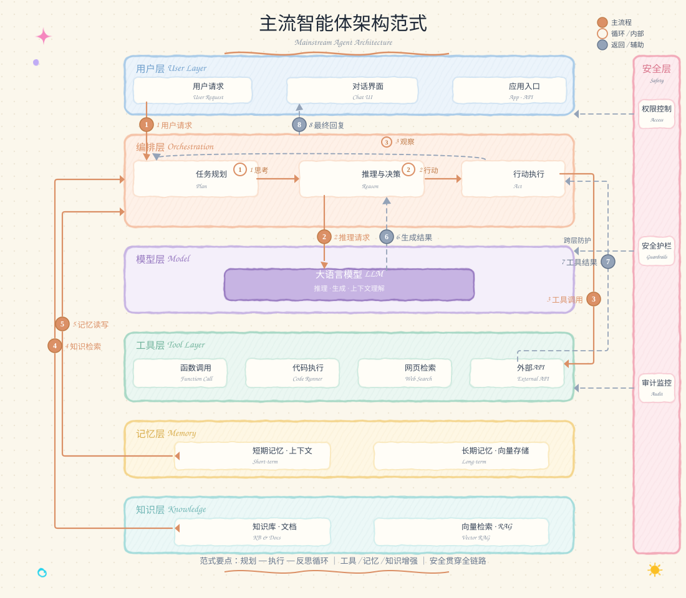

# AI Agent Skills 集合

这里收集了一系列**给 AI 助手用的技能包**。每个技能包教会 AI 做一类事情，你不需要懂任何技术，只要用大白话把你的需求说给 AI，它就能帮你完成。

## 已收录技能

| 技能 | 能帮你做什么 |
|---|---|
| [handdrawn-svg](handdrawn-svg/SKILL.md) | 把结构图、流程图、思维导图等画成「像用马克笔在纸上手绘」的示意图 |

以后会不断有新技能加入，直接新增在根目录下即可。

---

## handdrawn-svg · 手绘风示意图生成

### 这是什么

用 AI 帮你画示意图，但画出来不是死板的工程图，而是**像手绘笔记一样自然随性**的风格——线条有点抖、字体像手写、背景像网格纸，充满手账感。适合放进笔记、课件、汇报材料里，让内容看起来更亲切、更有温度。

### 它能画出什么

架构图、流程图、思维导图、系统结构图……只要你能用话描述清楚里面有哪些内容、彼此怎么连接，它就能画。

下面这张就是它画出来的效果示例：

### 怎么用

1. 打开支持加载技能包的 AI 助手；
2. 让它加载 `handdrawn-svg` 这个技能；
3. 用自然语言描述你想要的图，例如：
   - 「帮我画一张我的个人博客系统架构图，手绘风格」
   - 「画个流程图：用户登录 → 验证 → 进入首页，写得随意一点、像手账」
   - 「把这张图重画成手绘风」

### 小提示

- 把**结构说清楚**（有哪些模块、谁连谁）画出来就越接近你想要的样子；
- 如果对布局、颜色有偏好，也可以直接提，例如「从上到下分三层」；
- 生成的是矢量图（.svg），可以无损放大，放大多少都清晰。

## 许可

本项目未指定许可证，默认保留所有权利。如需复用，请先与作者联系。
